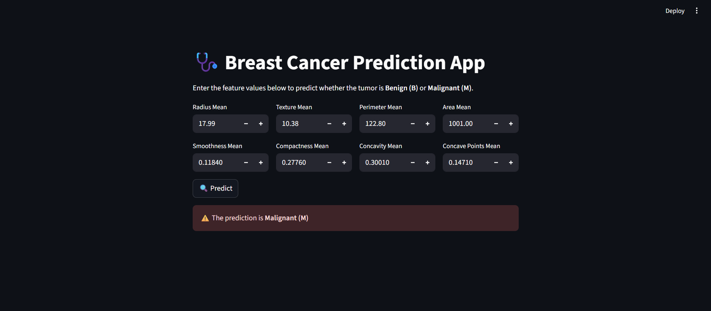

# 🩺 Breast Cancer Prediction

This project focuses on predicting whether a breast mass is **Malignant (M)** or **Benign (B)** using machine learning techniques.

---

## 📖 Dataset Description

| Feature | Description |
|---------|-------------|
| ID | Unique identifier for each sample (dropped during preprocessing) |
| Diagnosis | Target variable: `M` = Malignant, `B` = Benign |
| Radius | Mean distance from the center to points on the perimeter |
| Texture | Standard deviation of gray-scale values |
| Perimeter | Perimeter of the nucleus |
| Area | Area of the nucleus |
| Smoothness | Measure of local variation in radius lengths |
| Compactness | Calculated as `(perimeter^2 / area) - 1.0` |
| Concavity | Severity of concave portions of the nucleus contour |
| Concave Points | Number of concave portions of the nucleus contour |
| Symmetry | Measures symmetry of the nucleus |
| Fractal Dimension | Approximates the "coastline" of the nucleus using fractal geometry |

> Two columns (`ID` and `Unnamed: 32`) were dropped during preprocessing.

---

## 🛠️ Project Workflow

1. **Data Loading & Preprocessing**
   - Loaded the dataset using pandas.
   - Dropped unnecessary columns (`ID`, `Unnamed: 32`).

2. **Exploratory Data Analysis (EDA)**
   - Visualized correlations using a heatmap to understand feature relationships.

3. **Feature Selection**
   - Used **Random Forest Feature Importance**.
   - Selected **top 10 features** based on importance.

4. **Model Training & Evaluation**
   - Trained the **Random Forest** models using the top 10 columns selected by the Random forest feature importance.
   - Trained the following models using all the features.
     - **Logistic Regression**
     - **Support Vector Machine (SVM)**
     - **XGBoost**
   - Evaluated models using **accuracy**, **classification report**, and **confusion matrix**.

**Model Performance:**

| Model | Accuracy |
|-------|---------|
| Random Forest | 95.61% |
| Logistic Regression | 96.49% |
| SVM | 97.37% |
| XGBoost | 97.37% |

---

## 📦 Deployment

The **Random Forest model** was deployed using **Streamlit**. Users can input feature values through a web interface to get real-time predictions.

### Features Input (Streamlit App):
- Radius Mean
- Texture Mean
- Perimeter Mean
- Area Mean
- Smoothness Mean
- Compactness Mean
- Concavity Mean
- Concave Points Mean

## 🛠️ Streamlit App Workflow

- Input 8 key features through number input fields.

- Warning if no input is provided.

- Scale input using pre-saved scaler.

- Predict using the saved Random Forest model.

- Display prediction: ✅ Benign / ⚠️ Malignant.

---
### Streamlit App Preview

---

## ⚙️ Tech Stack

- Python 
- pandas
- numpy
- matplotlib
- seaborn
- scikit-learn
- xgboost
- pickle
- Streamlit

